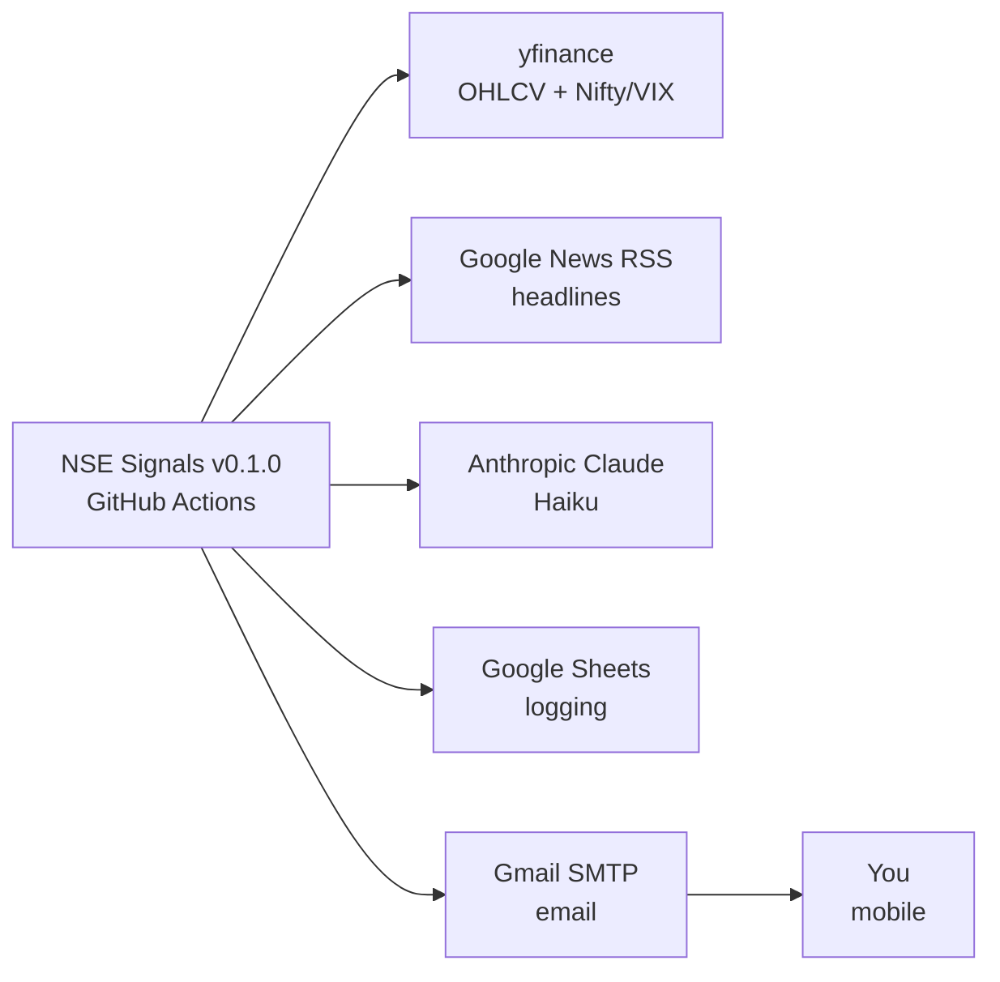
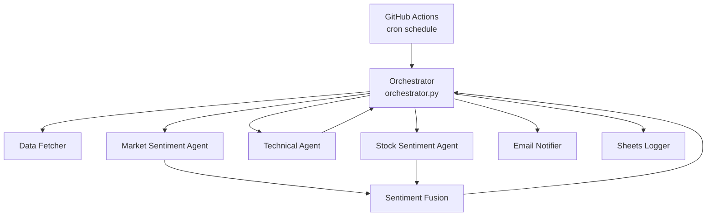
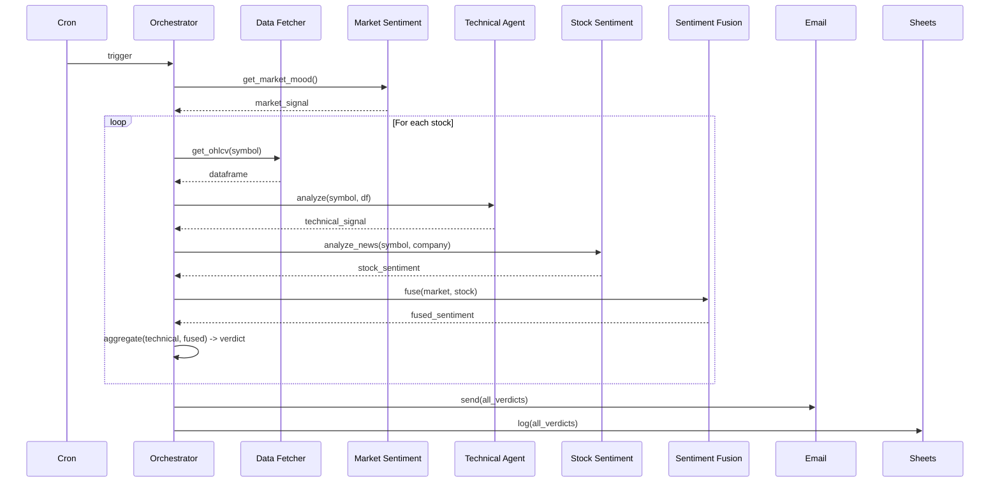

# v0.1.0 — Architecture

## Goal

Every 15 minutes during NSE market hours, analyze 5 hardcoded large-cap stocks
using one technical indicator (RSI) and a two-tier sentiment system
(market mood + per-stock news), then email a consolidated recommendation
and log everything to Google Sheets.

## System Context

## Component Diagram

## Per-Run Sequence

## Component List

| Component | Role | Path |
|---|---|---|
| **Orchestrator** | Coordinates the run, no business logic | `orchestrator.py` |
| **Data Fetcher** | Pulls OHLCV via yfinance | `agents/data_fetcher/` |
| **Technical Agent** | RSI-based signal (rule-based, no LLM) | `agents/technical/` |
| **Market Sentiment Agent** | Claude Haiku reads Nifty/VIX/global cues | `agents/market_sentiment/` |
| **Stock Sentiment Agent** | Claude Haiku reads per-stock news | `agents/stock_sentiment/` |
| **Sentiment Fusion** | Weighted combine + market-override rule | `agents/sentiment_fusion/` |
| **Email Notifier** | HTML email via Gmail SMTP | `lib/email_notifier.py` |
| **Sheets Logger** | Append row per signal to Google Sheet | `lib/sheets_logger.py` |
| **Contracts** | Shared dataclasses for signals | `lib/contracts.py` |

## Schedule

- **Cron:** `*/15 9-15 * * 1-5` (every 15 min, hours 9–15 UTC = 14:30–20:30 IST window)
- **Refined logic in code:** only proceed if current IST time is between 09:15 and 15:30
- **Days:** Monday–Friday
- **Holidays:** Not handled in v0.1.0 (best effort; bad runs will simply produce no signals)

## Error Handling Principle

- One stock fails → skip it, continue with others
- All stocks fail → still send an email with the error summary
- Never crash silently
