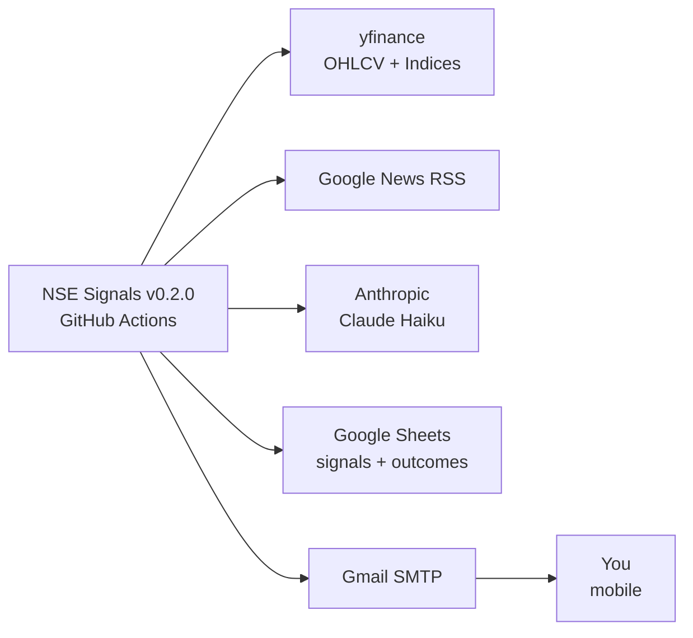
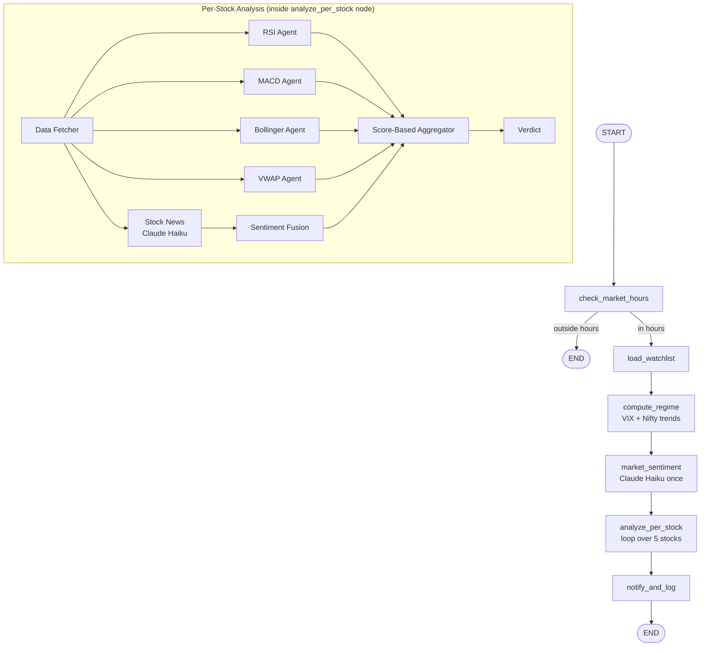
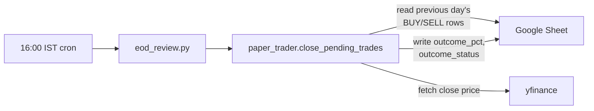

# v0.2.0 — Architecture

## Goal

Expand the signal generation from 1 technical indicator + sentiment to 4 diverse
indicators (covering momentum, trend, volatility, volume) + sentiment, combined
with a proper weighted aggregator. Migrate orchestration to LangGraph. Begin
collecting per-indicator outcome data via a paper trader.

## System Context

## Pipeline Topology (LangGraph)

## EOD Workflow (separate cron)

## Component List

| Component | Role | Path |
|---|---|---|
| **Orchestrator** | LangGraph runner | `orchestrator.py` |
| **EOD Reviewer** | Close paper trades | `eod_review.py` |
| **Secret Validator** | Fail-fast on missing/blank secrets | `lib/secret_validator.py` |
| **Aggregator** | Weighted score across all signals | `lib/aggregator.py` |
| **Paper Trader** | EOD outcome calculator | `lib/paper_trader.py` |
| **LangGraph State** | Shared state schema | `lib/langgraph_state.py` |
| **Data Fetcher** | yfinance wrapper | `agents/data_fetcher/` |
| **RSI Agent** | Mean reversion | `agents/rsi/` |
| **MACD Agent** | Trend / momentum | `agents/macd/` |
| **Bollinger Agent** | Volatility mean reversion | `agents/bollinger/` |
| **VWAP Agent** | Volume confirmation | `agents/vwap/` |
| **Market Sentiment** | Macro mood (Claude Haiku) | `agents/market_sentiment/` |
| **Stock Sentiment** | Per-company news (Claude Haiku) | `agents/stock_sentiment/` |
| **Sentiment Fusion** | Combine market + stock | `agents/sentiment_fusion/` |
| **Email Notifier** | HTML email | `lib/email_notifier.py` |
| **Sheets Logger** | Append rows + write outcomes | `lib/sheets_logger.py` |
| **Contracts** | Signal, Verdict, Regime dataclasses | `lib/contracts.py` |

## Indicator Diversity Justification

We deliberately chose indicators that capture different dimensions of price action:

| Dimension | Indicator | Why |
|---|---|---|
| Momentum (rate of change) | RSI | Mean reversion at extremes |
| Trend direction & strength | MACD | Cleaner trend signal than EMA cross |
| Volatility / mean reversion (vol-aware) | Bollinger Bands | Adapts to changing volatility |
| **Volume confirmation** | VWAP | The only volume-based indicator; institutional benchmark |

We dropped EMA crossover (planned in earlier drafts) because it's heavily
correlated with MACD. Adding VWAP gives a categorically different signal.

## Schedule

- **Main signals workflow**: every 15 min, 9:15–15:30 IST, Mon–Fri
- **EOD review workflow**: 16:00 IST, Mon–Fri (after market close)
- Both workflows support `workflow_dispatch` for manual triggering

## Error Handling

Same defensive pattern as v0.1.0:
- One stock failure → skip it, continue
- Any agent failure → return HOLD with confidence 0
- Sheet logging failures don't break the run (try/except wraps it)
- Secret validation runs first; if it fails, no agents run

## Future Extensibility (v0.3.0+)

The LangGraph topology is designed so that:
- `analyze_per_stock` becomes a parallel `Send`-based fanout (v0.3.0)
- `compute_regime` can route to different aggregator weights (v0.4.0)
- A `reviewer` node can be added after `notify_and_log` (v0.5.0)
- `risk_manager` node added between `analyze_per_stock` and `notify_and_log` (v0.6.0)
