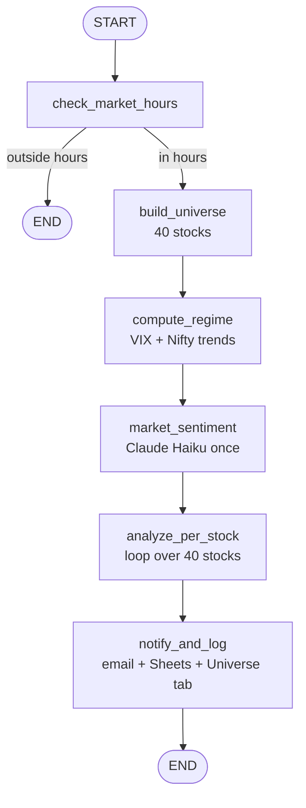
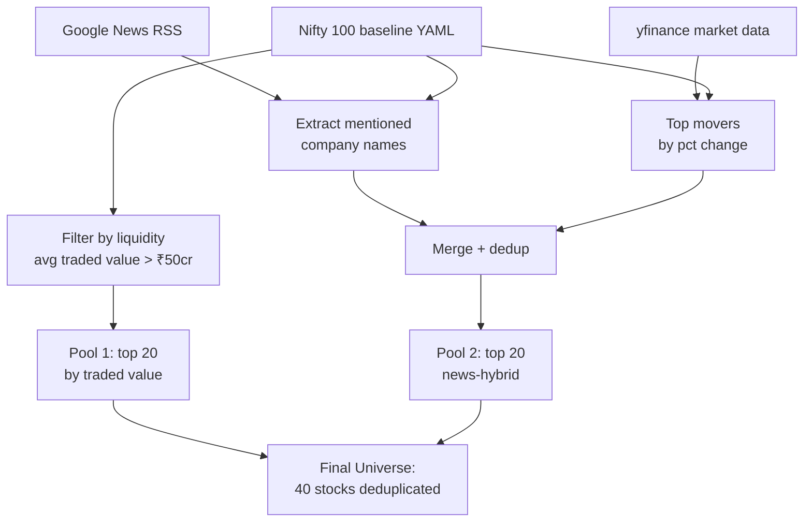
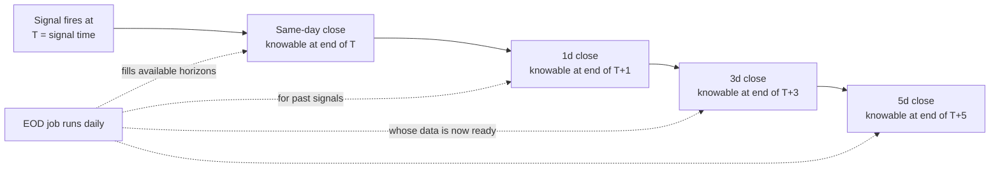

# v0.3.0 — Architecture

## Goal

Expand from a hardcoded 5-stock watchlist to a dynamic 40-stock universe
selected daily, while adding multi-horizon outcome tracking and a backtesting
harness for historical validation.

## What's New

| Capability | Source |
|---|---|
| Universe Agent | Dynamic stock selection: 20 Nifty 100 + 20 news-hybrid |
| Multi-horizon outcomes | eod, 1d, 3d, 5d returns per signal |
| Backtesting | `vectorbt`-based historical replay |
| Universe Sheet tab | Daily snapshot of selected stocks |

## Pipeline Topology (LangGraph)

## Universe Agent Detail

## Multi-Horizon Outcome Flow

For each signal:
- After today's EOD: fill `outcome_eod_pct`
- After next-day EOD: fill `outcome_1d_pct`
- After 3 trading days: fill `outcome_3d_pct`
- After 5 trading days: fill `outcome_5d_pct`
- When any horizon is filled: compute `outcome_best_horizon`

## Component Additions

| Component | Path |
|---|---|
| Universe Agent | `agents/universe/` |
| Backtester | `lib/backtester.py` |
| Multi-horizon outcomes | `lib/multi_horizon_outcomes.py` |
| Backtest CLI | `backtest.py` |
| Baseline data | `data/nifty_100_baseline.yaml` |
| Config | `config/universe_config.yaml` |

## Schedule (Unchanged)

- Main signals: every 15 min during market hours via cron-job.org
- EOD review: once at 16:00 IST via cron-job.org
- Universe build: triggered as part of every main run; logged to Universe tab only at first run of the day (~9:15-9:30 IST)
